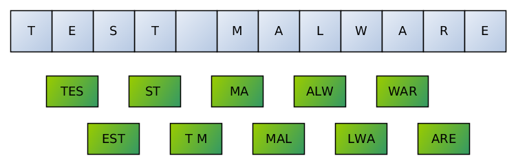
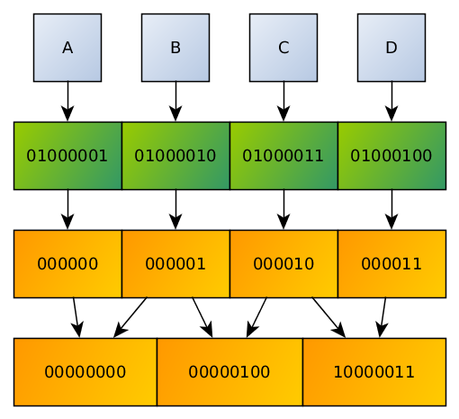
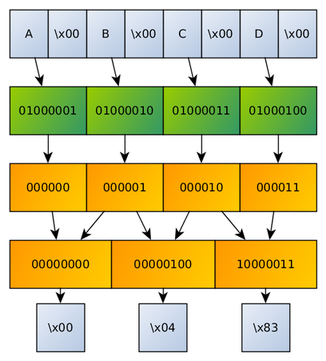

UrsaDB
======

A 3gram search engine for querying Terabytes of data in milliseconds. Optimized for working with binary files (for example, malware dumps).

Created in [CERT.PL](https://cert.pl). Originally by Jarosław Jedynak ([tailcall.net](https://tailcall.net)), extended and improved by Michał Leszczyński.

How does it work?
-----------------

### gram3 index

UrsaDB is using few slightly different methods of indexing files, having `gram3` indexes as a most basic concept.

When the database is about to create a `gram3` index for a given file, it extracts all possible three-byte combinations from it. An index is a big map of: `3gram` => `list of files which contain it`.

For instance, if we would index a text file containing ASCII string `TEST MALWARE` (ASCII: `54 45 53 54 20 4D 41 4C 57 41 52 45`), then the database would generate the following trigrams (`_` denotes space character):

| # | Substring | Trigram    |
| - | --------- | ---------- |
| 0 | `TES`     | `544553`   |
| 1 | `EST`     | `455354`   |
| 2 | `ST_`     | `535420`   |
| 3 | `T_M`     | `54204D`   |
| 4 | `_MA`     | `204D61`   |
| 5 | `MAL`     | `4D616C`   |
| 6 | `ALW`     | `414C57`   |
| 7 | `LWA`     | `4C5741`   |
| 8 | `WAR`     | `574152`   |
| 9 | `ARE`     | `415245`   |



An index maps a trigram to a list of files, so the new file will be added to the abovementioned lookups.

### gram3 queries
When querying for string `TEST MALWARE`, the database will query trigram index in order to determine which files do contain sequence `544553`, then which files contain `455354` and so on till `415245`. Such partial results will be ANDed and then the result set (list of probably matching files) is returned.

The drawing presents how trigrams are mapped to file contents.


Such searching technique sometimes may yield false positives, but it's never going to yield any true negatives. Thus, it may be appropriate for quick filtering (see [mquery project](https://github.com/CERT-Polska/mquery) - we use UrsaDB there in order to accelerate the process of malware searching).

### text4 index

String literals are very common in binaries. Thus, it's useful to have a specialized index for ASCII characters.

In `text4` index, ASCII characters are packed in a manner similar to [base64](https://en.wikipedia.org/wiki/Base64) algorithm. Due to that, it is possible to generate a trigram out of four characters.



Note that such an index doesn't respond to queries containing non-ASCII bytes, so it should be combined with at least `gram3` index.

### wide8

Because searching for `UTF-16` is also useful, there is a special index which works similarily to `text4`. In this case, ASCII characters interleaved with zeros are decoded.



### hash4

Yet another type of index is `hash4`, which creates trigrams based on hashes of 4-byte sequences in the source file.


Full package installation
-------------------------

This repository is only for UrsaDB project (3gram database). In order to see instructions on how to set up the whole mquery system, see [CERT-Polska/ursadb](https://github.com/CERT-Polska/mquery).


Installation (Docker way)
-------------------------

Docker image may be built by executing `docker build -t ursadb .` on the source code pulled from this repo.


Installation (standard way)
---------------------------

1. Compile from sources:
```
$ mkdir build
$ cd build
$ cmake -D CMAKE_C_COMPILER=gcc-7 -D CMAKE_CXX_COMPILER=g++-7 -D CMAKE_BUILD_TYPE=Release ..
$ make
```

2. Deploy output binaries (`ursadb`, `ursadb_new`) to appropriate place, e.g:
```
# cp ursadb ursadb_new /usr/local/bin/
```

3. Create new database:
```
$ mkdir /opt/ursadb
$ ursadb_new /opt/ursadb/db.ursa
```

4. Run UrsaDB server:
```
$ ursadb /opt/ursadb/db.ursa
```

5. (Optional) Consider registering UrsaDB as a systemd service:
```
cp contrib/systemd/ursadb.service /
systemctl enable ursadb
```


Usage
-----

Interaction with the database could be done using `ursadb2-client` (see another repository).


Queries
-------

### Indexing
#### Directly provided paths
A filesystem path could be indexed using `index` command:

```
index "/opt/something";
```

or multiple paths at once:

```
index "/opt/something" "/opt/foobar";
```

by default it will be indexed using `gram3` index. Index types may be specified manually:

```
index "/opt/something" with [gram3, text4, hash4, wide8];
```

#### Paths in a list file
For convenience it's also possible to make UrsaDB read a file containing a list of targets to be indexed,
each one separated by a newline.

```
index from list "/tmp/file-list.txt"
```

or

```
index from list "/tmp/file-list.txt" with [gram3, text4, hash4, wide8];
```

while exemplary contents of `/tmp/file-list.txt` is:

```
/opt/something
/opt/foobar
```

### Select
#### Strings ("primitives")
Select queries could use ordinary strings, hex strings and wide strings.

Query for ASCII bytes `abc`:
```
select "abc";
```

The same query with hex string notation:
```
select {616263};
```

Query for wide string `abc` (the same as `{610062006300}`):
```
select w"abc";
```

#### Logical operators
Elements could be AND-ed:
```
select "abc" & "bcd";
```

and OR-ed:
```
select "abc" | "bcd";
```

Queries may also use parenthesis:
```
select ("abc" | "bcd") & "cde";
```

#### Minimum operator
You may query for samples which contain at least N of M strings:
```
select min 2 of ("abcd", "bcdf", "cdef");
```

is equivalent to:

```
select ("abcd" & "bcdf") | ("abcd" & "cdef") | ("bcdf" & "cdef");
```

Note that `min N of (...)` is executed more efficiently than latter "combinatorial" example. Such syntax is directly corresponding to yara's "[sets of strings](https://yara.readthedocs.io/en/v3.4.0/writingrules.html#sets-of-strings)" feature.

This operator accepts arbitrary expressions as it's arguments, e.g.:
```
select min 2 of ("abcd" & "bcdf", "lorem" & "ipsum", "hello" & "hi there");
```
in this case inner expressions like `"abcd" & "bcdf"` will be evaluated first.

Minimum operator could be also nested in some expression, e.g.:
```
select "abcd" | ("cdef" & min 2 of ("hello", "hi there", "good morning"));
```

### Status
Query for the status of tasks running in the database:
```
status;
```

The output format is a JSON object with the details of all tasks. Exact format of these sub-objects is defined in [Responses.cpp](https://github.com/CERT-Polska/ursadb/blob/master/Responses.cpp). See `ursadb-cli` for a working implementation.

### Topology
Check current database topology - what datasets are loaded and which index types they use.
```
topology;
```

Exemplary output:
```
> topology;
OK
DATASET aa266884
INDEX aa266884 gram3
INDEX aa266884 text4

DATASET bc43a921
INDEX bc43a921 gram3
INDEX bc43a921 text4
```

Means that there are two datasets (partitions), both backed with indexes of type `gram3` and `text4`.

### Reindex
Add new index type to the existing dataset. Before reindexing, you need to determine the ID of the dataset
which has to be indexed (may be done using `topology` command).

Example:
```
reindex "bc43a921" with [hash4];
```

will reindex already existing dataset `bc43a921` with `hash4` type index.

### Compact
Force database compacting.

In order to force compacting of all datasets into a single one:
```
compact all;
```

In order to force smart compact (database will decide which datasets do need compacting, if any):
```
compact smart;
```
