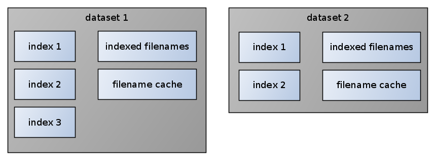

# Datasets

**TL;DR:** Every dataset represents a collection of indexed files. Datasets can be
tagged and merged. Avoid too small datasets (<1000 files) or too many datasets (>100).

Internally all files are indexed by ursadb and stored in datasets.

Dataset is a collection of one or more indexes (read also about
[index types](./indextypes.md)) It's the smallest collection of files
ursadb understands, and most commands work on one or more datasets.
For example, it's easy to remove a dataset from ursadb
with `dataset "dataset_id" drop` command, but removing a single file from
indexes in dataset is very hard (in fact, not implemented).



When indexing new files, they are initially saved as very small datasets -
usually smaller than 1000 files. That's because indexer can't fit more files
in memory when indexing. But having too many small datasets is unhealthy for
mquery. Querying 1000 or 10000 datasets has much more overhead than querying 10 ones.

In theory you can merge all your datasets into one (using `compact all;` command
repeatedly). This will work, but it's not recommended. That's because
queries on really huge datasets can consume a lot of RAM (especially with
wildcards), and because you can't benefit from streaming partial results.
Empirically, 1M files per dataset is a good upper limit, but historically we've
used datasets with many millions of samples and they work correctly.

### tags

Datasets can be marked with arbitrary tags. Datasets with different tags will
never merge with each other. Uses for tags that you may consider:

- add `size:small` tag for small files and `size:large` for others. Most interesting
    malware files are small, so you can speed up most of your searches that way
- add `tlp:white` tags for public samples, to easily find publicly accessible
    instances of the sample you're interested in.

You can add tags when [indexing new files](./indexing.md), or with ursacli:

```
ursacli
ursadb> dataset "dataset_id" taint "tag_name"
```

For docker-compose deployments:


```
docker-compoes exec ursadb ursacli -c 'dataset "dataset_id" taint "tag_name";'
```

You can also remove them in the same way:

```
ursacli
ursadb> dataset "dataset_id" untaint "tag_name"
```

### adding and removing files

To add dataset with new files, [index them](./indexing.md).

To remove a dataset, use ursacli:

```
ursacli
ursadb> dataset "dataset_id" drop
```

Removing single files from indexes is not implemented. If you really need it,
consider:
 - if all unnecessary files have similar filenames, use `RegexBlacklistPlugin` in mquery, for example to exclude all `pcap` files
 - drop appropriate dataset and reindex your collection without unnecessary files
 - submit a PR to ursadb, or at least create an issue and explain your problem
